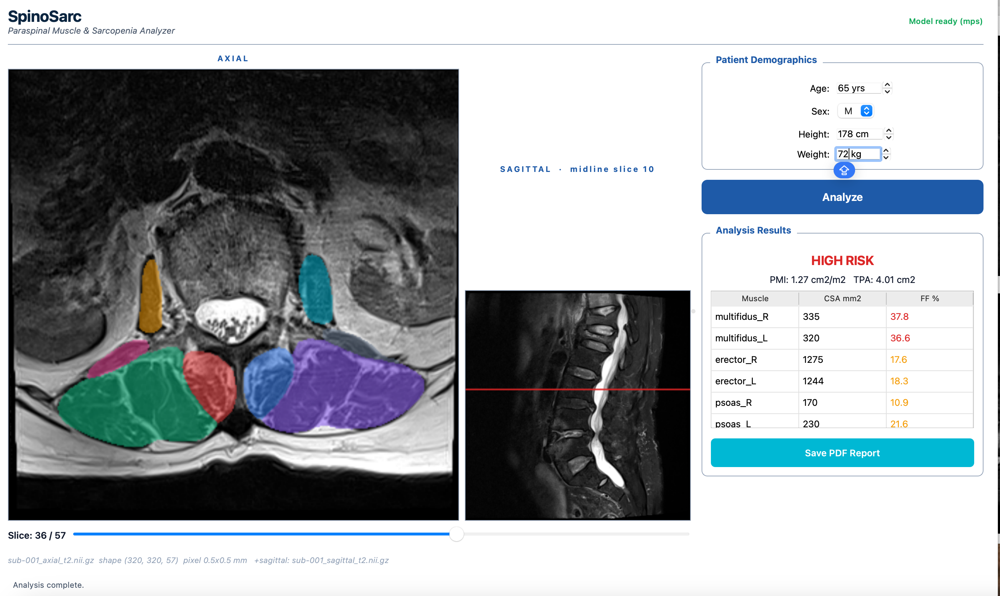

# SpinoSarc

**An open-source desktop tool for quantitative paraspinal muscle and dural sac analysis on lumbar spine MRI.**

[](https://doi.org/10.5281/zenodo.20760332)
[](https://opensource.org/licenses/MIT)
[](https://www.apple.com/macos/)
[](DISCLAIMER.md)


> ⚠️ **Research use only.** SpinoSarc has not received FDA, CE, or any other regulatory approval. It must not be used for clinical decision-making. See [DISCLAIMER.md](DISCLAIMER.md).

---

## Screenshots



*Main application window: axial and sagittal viewers, patient demographics, automatic lumbar level detection, and per-muscle analysis results.*

## Overview

SpinoSarc is a native macOS application for automated quantitative analysis of paraspinal musculature and dural sac on lumbar spine MRI. It provides an end-to-end workflow from DICOM ingestion to PDF/Excel reporting, fully offline.

**Key features:**

- 🗂️ **DICOM ingestion** with multi-vendor support (Siemens, Philips, GE) including JPEG Lossless decompression
- 🧠 **Paraspinal muscle segmentation** via the [MuscleMap](https://github.com/MuscleMap) U-Net backbone — 8 muscle classes (multifidus, erector spinae, psoas, quadratus lumborum; left and right)
- 🦴 **Automatic lumbar level detection** via [TotalSpineSeg](https://github.com/neuropoly/totalspineseg) — labels intervertebral discs (L1-L2 … L5-S) and maps them onto the axial series
- 🩺 **Automatic dural sac segmentation** — cross-sectional area computed directly from the TotalSpineSeg canal mask (no manual ROI required)
- 🔬 **Multi-level analysis** — paraspinal muscle metrics + dural sac CSA at every detected level in a single run; levels falling in axial gaps use the nearest slice (flagged with distance)
- 📏 **Canal narrowing flags** — neutral measurement against published dural-sac thresholds (absolute <75, relative <100, early <130 mm²); a research aid for the radiologist, **not a diagnosis**
- 📐 **Quantitative metrics**: cross-sectional area (CSA), fat fraction, total psoas area (TPA), psoas muscle index (PMI)
- 📊 **Reference values** from published literature (Hamaguchi 2016, Englesbe 2010, Barz 2010) — for context, not classification
- 📄 **PDF and Excel reports** — single-slice and multi-level, for downstream analysis
- 🔒 **Fully offline** — no data leaves the device

## Installation

### macOS (Apple Silicon: M1, M2, M3, M4)

1. Download the latest release `SpinoSarc-X.Y.Z.dmg` from the [Releases](https://github.com/neuromath/spinosarc/releases) page.
2. Open the `.dmg` file.
3. Drag **SpinoSarc.app** to the `Applications` folder.
4. **First launch only**: Right-click SpinoSarc.app in Applications → "Open" → "Open" again (to bypass macOS Gatekeeper, as the app is not code-signed).

**System requirements:**

- macOS 11.0 (Big Sur) or later
- Apple Silicon Mac (M1 / M2 / M3 / M4)
- ~2 GB free disk space
- No internet connection required

### From source (developers)

```bash
git clone https://github.com/neuromath/spinosarc.git
cd spinosarc
conda create -n spinosarc python=3.11
conda activate spinosarc
conda install -c conda-forge dcm2niix
pip install -r requirements.txt

# Clone MuscleMap separately (segmentation backbone)
git clone https://github.com/MuscleMap/MuscleMap.git ~/SpinoSarc/MuscleMap

# Run from source
python -m spinosarc_app.gui
```

## Quick Start

1. **Launch SpinoSarc**
2. **Drag a lumbar MR DICOM folder** (or NIfTI files) onto the drop zone
3. **Enter patient demographics** (optional, used for PMI calculation)
4. **Click "Detect Levels"** — TotalSpineSeg labels the lumbar discs and segments the spinal canal (~60 seconds on Apple Silicon, first run)
5. **Click a level** in the list to jump to its axial slice
6. **Click "Analyze"** for the current slice, or **"Analyze All Levels"** to run every detected level (muscle + dural sac + canal flags) in one pass
7. **Export** results as PDF or Excel — the report is multi-level when a multi-level analysis has been run
8. **Click "New Case"** to clear and start over

## What SpinoSarc Reports

For each analyzed slice:

| Metric | Description |
|---|---|
| Per-muscle CSA (mm²) | Cross-sectional area for each of 8 muscles |
| Per-muscle fat fraction (%) | Intensity-based fat estimate |
| Total Psoas Area (cm²) | Sum of left + right psoas CSA |
| Psoas Muscle Index (cm²/m²) | TPA normalized by patient height (if provided) |
| Dural Sac CSA (mm²) | Automatic, from the TotalSpineSeg canal mask |
| Canal narrowing flag | Neutral comparison against literature thresholds (not a diagnosis) |

When **Analyze All Levels** is used, these metrics are reported for every detected level (L1-L2 … L5-S) plus L3-based sarcopenia, with flags for levels measured from a nearby slice (axial gaps) and a caveat at L5-S where the thresholds are less reliable.

Reference cut-off values from the literature are displayed for context but **no automated diagnosis** is performed.

## How It Differs From MuscleMap

SpinoSarc uses [MuscleMap](https://github.com/MuscleMap) as its segmentation engine. The contribution of SpinoSarc is the **clinical research infrastructure surrounding the segmentation**:

- DICOM ingestion (MuscleMap requires NIfTI)
- Anatomical coordinate alignment between axial and sagittal series
- Automatic lumbar level detection and dural sac segmentation (TotalSpineSeg)
- Multi-level analysis across all lumbar levels in a single run
- Quantitative metric extraction with literature reference values
- Neutral canal-narrowing flags (research aid, not diagnosis)
- PDF / Excel reporting (single-slice and multi-level)
- Native macOS desktop application — no programming required

## Citation

If you use SpinoSarc in your research, please cite:

```bibtex
@software{yilmaz2026spinosarc,
  author       = {Yılmaz, Berkay},
  title        = {SpinoSarc: An open-source tool for quantitative
                  paraspinal muscle and dural sac analysis on lumbar
                  spine MRI},
  year         = {2026},
  url          = {https://github.com/neuromath/SpinoSarc},
  version      = {0.1.0},
  doi          = {10.5281/zenodo.20760332},
  orcid        = {0009-0006-3108-8991}
}
```

Please also cite the underlying segmentation backbone:

```bibtex
@software{musclemap,
  author = {{MuscleMap contributors}},
  title  = {MuscleMap: Open-source skeletal muscle segmentation},
  url    = {https://github.com/MuscleMap/MuscleMap}
}
```

## License

SpinoSarc is released under the [MIT License](LICENSE).

Third-party components are distributed under their respective licenses; see [LICENSE](LICENSE) for the full list.

## Acknowledgments

- **MuscleMap** team for the open-source segmentation backbone
- **MONAI** and **PyTorch** communities
- **dcm2niix** (Chris Rorden) for robust DICOM-to-NIfTI conversion
- **Cerrahpaşa Faculty of Medicine** for clinical context
- **Reference literature**:
  - Barz T et al. (2010) — Dural sac CSA thresholds
  - Hamaguchi Y et al. (2016) — PMI reference values
  - Englesbe MJ et al. (2010) — Psoas area in surgical risk

## Author

**Berkay Yılmaz**
Radiology Resident, Cerrahpaşa Faculty of Medicine
Istanbul University-Cerrahpaşa, Istanbul, Turkey
ORCID: [0009-0006-3108-8991](https://orcid.org/0009-0006-3108-8991)
GitHub: [@neuromath](https://github.com/neuromath)

## Contributing

Issues and pull requests are welcome. Please open a GitHub issue for bug reports or feature requests.

For substantive contributions, please ensure:

- No patient data is committed (see `.gitignore`)
- Code is documented in English
- Changes are tested on at least one public dataset (e.g., RSNA 2024 Lumbar Spine)

## Disclaimer

**Research use only.** See [DISCLAIMER.md](DISCLAIMER.md) for full terms.
